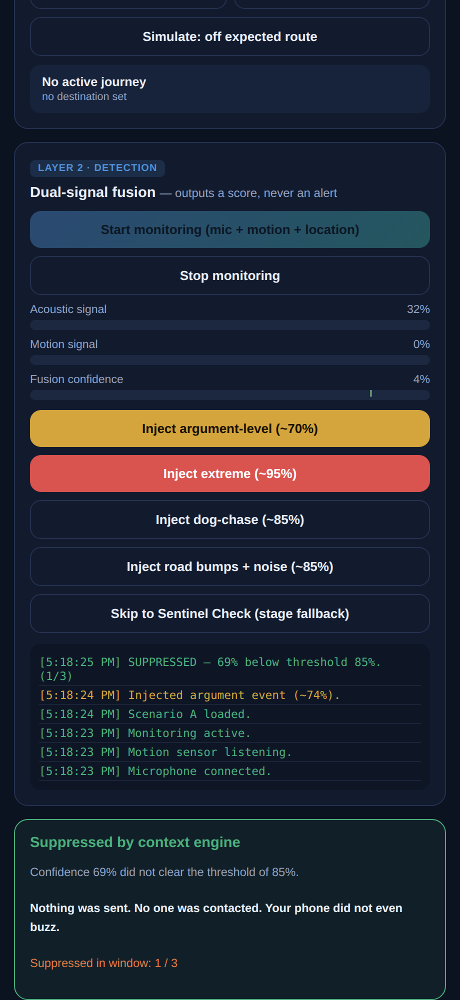
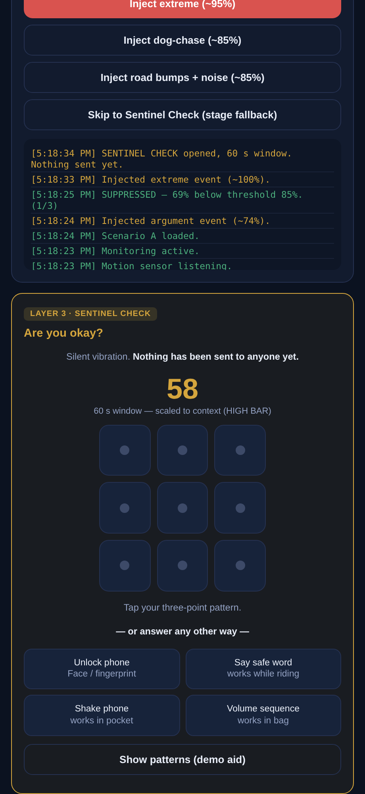
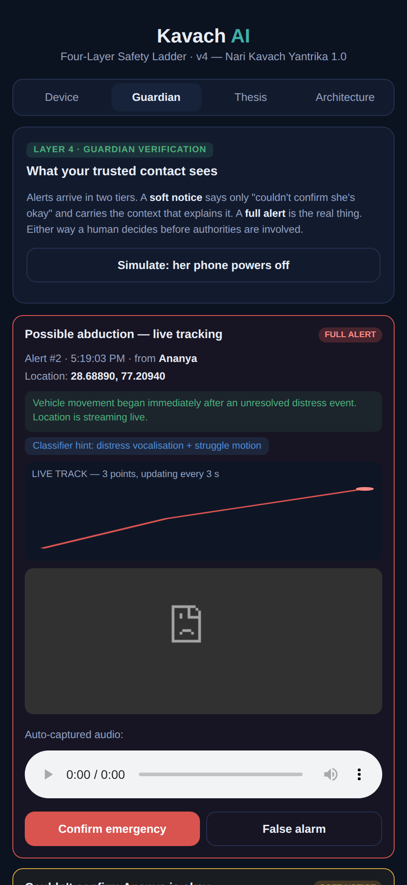
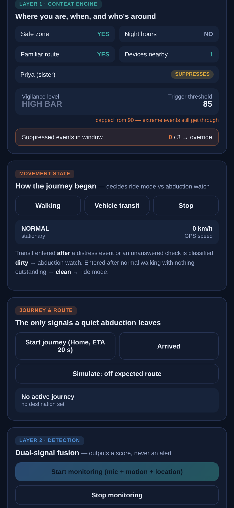

# Kavach AI — Your Invisible Shield

A passive women's-safety system **designed on the assumption that its own detector will sometimes be wrong.**

Built for **Code Build 1.0** by **Team ThunderHawks** — Hriddhi Srivastava, Siddhi Srivastava.

---

## The problem

Every mainstream safety app — panic buttons, the 112 India app, campus apps, wearable SOS — shares one design assumption: that the person in danger can reach their phone and press something.

In the moments these tools exist for — being grabbed, restrained, or frozen by fear — that is exactly the assumption that fails.

> **The one action they all require is the one action you cannot take.**

## The harder problem

The obvious fix is "use AI to detect a scream and send an SOS." That breaks too, and it is worth being honest about why:

**No classifier — ours, Google's, anyone's — can reliably distinguish an angry scream at a sibling from a terrified scream at an attacker.** Audio and motion do not carry that information.

A system built on that premise fires during every argument. Guardians learn to ignore it. If it auto-dials police, it burns real emergency resources on noise. The tool destroys its own credibility.

## Our approach

We stopped trying to build a perfect detector and built a system that stays safe when the detector is wrong.

> **We don't claim to distinguish an angry scream from a terrified one. We built a system where it doesn't matter.**

---

## Quick start

No build step, no dependencies. It is a single self-contained HTML file.

```bash
python -m http.server 8000
```

Then open **`http://localhost:8000/kavach_ai_demo.html`**.

> **Why not just double-click the file?**
> Browsers only grant microphone, motion and vibration access on a *secure origin* — `https://` or `localhost`. Opening the file directly (`file://`) renders the page but leaves every sensor dead.

**To run it on a phone** with real motion sensors, use `kavach_server.py`, which generates its own certificate and serves over HTTPS on your local network:

```bash
pip install cryptography
python kavach_server.py
```

It prints an address for the laptop and one for the phone.

---

## What it looks like

**Context suppression — an argument at home produces nothing.**
The threshold is raised to 85, the injected event peaks at 69%, and the system stays completely silent.



**Sentinel Check — the phone asks you first, five ways to answer.**
Nothing has been sent to anyone at this point. The window length is set by context.



**Abduction watch — the guardian's view, with a live location trail.**
Vehicle movement began right after an unresolved distress event, so the system streams a track rather than sending a single pin.



**The context engine.**
Trusted devices can be switched between *suppresses* and *guardian only*. The suppressed-event counter drives the repeat-suppression override.



---

## The four-layer safety ladder

Detection is deliberately demoted. It produces a score and can contact nobody. Three independent layers surround it, and each one on its own is enough to stop a false positive from causing harm.

### Layer 1 — Context Engine

Decides how sceptical to be *before* detection matters. Place, time of day, route familiarity and which trusted devices are nearby set a **dynamic threshold**.

The threshold is **capped at 85**, never higher. Context can raise the bar; it can never close the door. Since the Layer 3 check costs the user only a single vibration, there is no justification for ever disabling detection completely.

### Layer 2 — Detection

Dual-signal fusion of audio and motion. Requiring both rules out the dropped-phone and loud-room failure modes of single-sensor systems.

An event is judged on its **peak over an 800 ms window**, not on the rising edge — otherwise a genuine extreme event trips the suppression branch on its way up past the event floor. This layer outputs a confidence score and has no authority to contact anyone.

### Layer 3 — Sentinel Check (dead-man's switch)

When the gate opens, the phone still alerts nobody. It vibrates silently and asks **you** to confirm you are fine, on a window that scales with context — 15 s when pre-armed, up to 60 s at home, longer while riding.

**Five ways to answer:** tap pattern · phone unlock · spoken safe word · shake · volume-key sequence.

The inversion that makes this work: in a real emergency the victim *cannot* respond, so **non-response becomes the confirmation.** We trigger on inability to act rather than ability to press a button — the opposite of every manual SOS product. Widening "answer" to five independent channels improves both error rates at once: silence across all five is far stronger evidence of genuine inability than one missed tap.

A **duress pattern** — visually identical to an observer — displays a convincing "Cancelled" screen while escalating silently.

### Layer 4 — Guardian Verification

Escalation is graded. Non-response first produces a **soft notice** — *"Kavach could not confirm Ananya is okay"* — carrying the context that explains it (for example, that she appears to be travelling at 34 km/h and may be unable to reach her phone). It promotes to a **full alert** only if unresolved.

A human sees location, a ten-second audio clip and a classifier hint, and confirms before **any** authority is contacted. A recall button lets the user cancel within seconds.

### Manual override

A volume-button sequence, operable with the phone still in a pocket, **bypasses all four layers, always.** Context gates passive detection only. It can never block a deliberate call for help.

---

## When context itself is wrong

Trusted-device suppression is the strongest false-positive defence in the design and also its most dangerous component. If the person who harms the user is a registered contact standing in the room, a naive implementation disarms itself at exactly the wrong moment. Since most violence against women is committed by someone known to them, this is close to the median case, not an edge case.

Five safeguards exist specifically for it:

1. **The threshold is capped.** An extreme-confidence event clears the gate in any context whatsoever.
2. **One person is not a crowd.** A single suppression-eligible device contributes far less than two or more. Being alone with one individual is the abuse scenario; a room with three family members is the argument scenario.
3. **Suppression is opt-in, per contact.** A contact can be guardian-eligible without being suppression-eligible. New contacts default to guardian-only.
4. **Repeat-suppression override.** Three suppressed high-distress events inside the window discard suppression entirely. Chronic distress in a supposedly safe place with a trusted device present is not an argument — it is a pattern, and the pattern is the signal.
5. **Manual trigger bypasses everything**, in any configuration.

---

## Movement: riding versus being taken

Rough roads produce exactly the signature the detector hunts for — hard repeated motion plus loud ambient noise. But riding is *sustained, rhythmic, and travelling at 30+ km/h in a consistent direction*. Nothing like a few seconds of chaos.

So transit gets its own mode where motion is discounted and **crash detection** (a deceleration spike followed by stillness) replaces assault detection.

The trap: an abduction is also a vehicle journey. So **ride mode has to be earned, not granted.** The system asks not *"is this a vehicle?"* but **"how did this journey begin?"**

| Entry | Condition | Result |
|---|---|---|
| **Clean** | Walking gait, then vehicle motion, nothing outstanding | **Ride mode** — motion discounted, crash detection on, window extended |
| **Dirty** | A distress event or unanswered check immediately precedes vehicle motion | **Abduction watch** — threshold to the floor, guardians alerted at once, location streaming as a live trail |

In an abduction the most valuable output is not an alarm but **a live track police can follow**. A single pin from the moment of the grab is nearly useless twenty minutes later. If the phone powers off during an active watch, that itself is pushed to guardians.

---

## The six scenarios

Each is a button in the prototype.

| | Context | What the system does |
|---|---|---|
| **A** Argument at home | Safe zone, day, 2 suppression-eligible devices → threshold 85 | Argument-level event suppressed. An extreme event still clears the capped threshold. |
| **B** Alone at night | Unfamiliar, 23:00, no devices → threshold 30 | Clears immediately; sentinel opens with a short 15 s window. |
| **C** Known person | Safe zone, day, 1 suppression-eligible device | Two events suppressed; the third triggers the repeat-suppression override. |
| **D** Bike, bad roads | Walking → vehicle, nothing outstanding → clean entry | Motion discounted; bumps no longer trigger. A real crash still escalates. |
| **E** Abduction by car | Distress event, unanswered check, then vehicle motion → dirty entry | Abduction watch. Guardians alerted, live trail streaming. |
| **F** Quiet abduction | No violence at all | Passive detection has nothing to detect. Route deviation or a missed ETA triggers a proof-of-life check. |

---

## Tech stack

| Layer | Technology |
|---|---|
| Client | Web Audio API, DeviceMotion API, Geolocation API — runs in any phone browser, no install |
| Audio detection | On-device lightweight audio event classifier (YAMNet class); amplitude heuristic as the prototype stand-in |
| Motion detection | Accelerometer jerk and variance thresholding, on-device |
| Movement state | Android ActivityRecognition / iOS CMMotionActivity plus GPS speed |
| Proximity | BLE RSSI scanning for registered contact devices |
| Alerting | Twilio or WhatsApp Business API, SMS fallback for weak connectivity |
| Maps | OpenStreetMap embed; no API key required |

---

## What is real, and what is simulated

We would rather state this plainly than have it discovered.

**Real in the prototype** — live microphone amplitude sensing, live device-motion sensing, live GPS, real audio clip capture and playback, and the entire state machine: context scoring and the cap, the repeat-suppression override, transit entry classification, ride-mode motion discounting, abduction watch, the crash path, all five proof-of-life channels, context-scaled windows, soft-to-full promotion, recall, journey watch, route anomaly, live trail accumulation, and the guardian confirm/dismiss flow.

**Simulated by buttons** — BLE proximity, GPS speed and activity recognition (production uses the platform APIs listed above), the audio classifier's event label, the guardian roster, and phone power-off.

**Timings shortened for demo** — override window 3 minutes (spec: 20), journey ETA 20 seconds, soft-to-full promotion 20 seconds (spec: 60).

---

## Testing

```bash
npm install playwright
npx playwright install chromium
node tests/verify.js
```

An automated Playwright suite runs **43 end-to-end checks** across all six scenarios, covering the threshold cap, the repeat-suppression override, transit entry classification in both directions, crash detection, every proof-of-life channel, the duress path, soft-to-full promotion, recall, journey watch, route anomaly, live trail accumulation, and guardian confirmation.

All 43 pass with no console errors.

---

## Where this genuinely ends

A **quiet abduction** — no scream, no struggle, the phone kept, the victim walked away under threat — leaves passive detection nothing whatsoever to detect. We do not claim otherwise, and any team claiming their AI catches this should be disbelieved.

What remains there: the discreet manual trigger, and behavioural evidence — movement away from usual routes at an unusual hour, or a journey whose ETA passes without arrival — which triggers a proof-of-life check where the same dead-man's logic applies.

If an attacker destroys the phone outright, no software fixes that. A continuous trail up to that moment is the honest best; a companion wearable is the real answer, and it is a roadmap item rather than a hidden gap.

None of this fully solves intimate-partner violence. What it does guarantee is that the system **degrades toward vigilance rather than toward silence**, and that the user retains an unblockable manual path at all times.

---

## Beyond women's safety

The same ladder extends to elder care with fall detection, child safety, and lone-worker safety for institutions and campuses. It runs on any smartphone a user already owns — no hardware purchase, which matters for adoption at scale in India.

---

## Files

```
kavach_ai_demo.html      the app — single self-contained file
kavach_server.py         HTTPS server for phone testing (generates its own certificate)
1_RUN_ON_LAPTOP.bat      one-click launcher (Windows)
2_RUN_FOR_PHONE.bat      one-click phone launcher (Windows)
tests/verify.js          43-check end-to-end suite (Playwright)
docs/                    concept document, architecture diagram, deck, screenshots
```

---

**Team ThunderHawks** · Hriddhi Srivastava · Siddhi Srivastava
